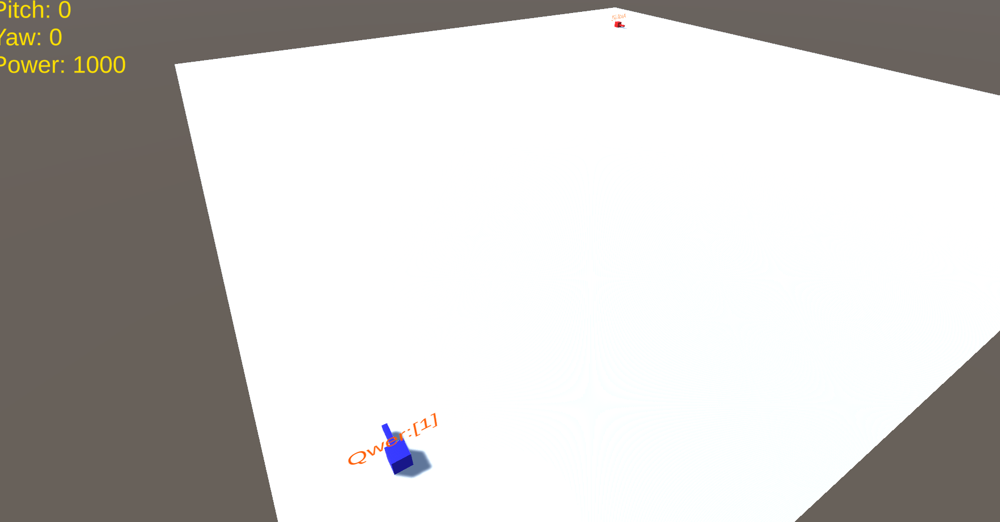
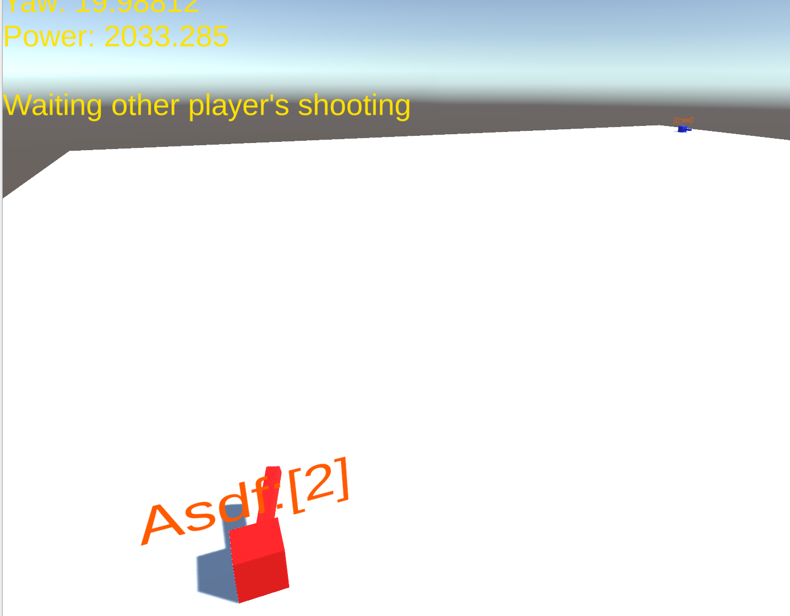
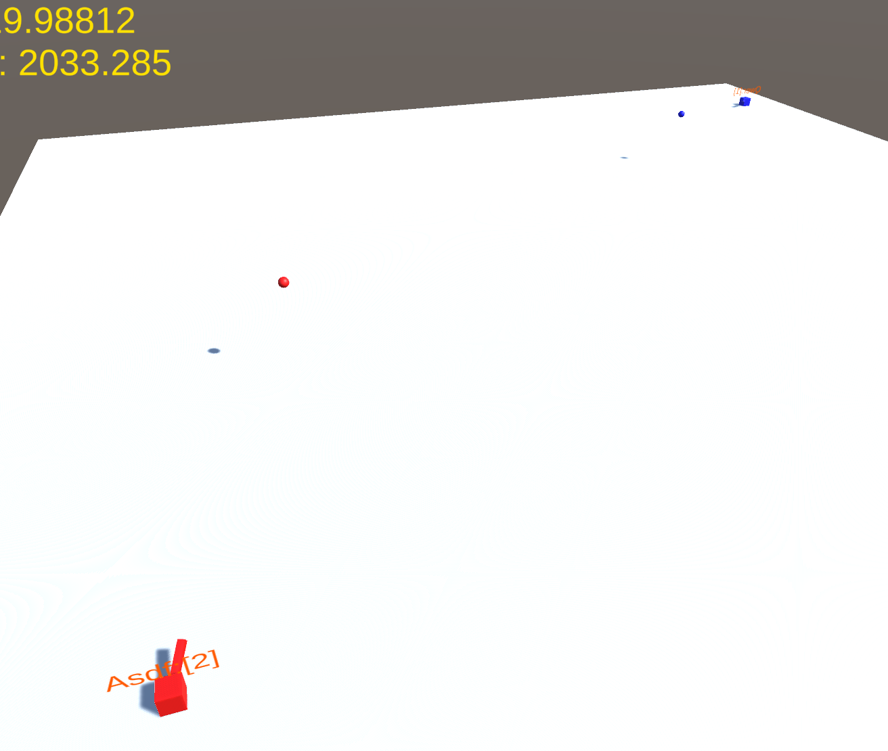

# Simple Tanks

Photon Unity Network (PUN) Turn-based Multiplay Simple Tank Shooting Game

For educational purpose at Namseoul University

Copyright iNTERVR (http://nsu-intervr.com)

# Specifications

Unity3D 2019.x later (sample was built 2019.2.14f1)

PUN 2.0 SDK

2 players turn-based tank shooting simulation game

# Required

Registration to PUN membership using Phton Cloud service. http://www.photonengine.com

PUN2 Free - Import from unity asset store

Setup Identity - AppId in your unity project

# Topic

Setup - Photon Unity Network (PUN) with Photon Cloude service.

Connection - Create / Join Room 

Synchronization - Play turn-based game

That's it. Enjoy!

# Game Design

- Multiplayer game
- Max 2 players in room
- Round robin turn-based
- Win to hit other tank *(up to you)*
- Tank Aiming & Shooting with power
- One shot one kill
- Simple art - assembled cubic tank, plane ground, big plane ground to collision check
- Disconnected by Timeout (just sample)

# Sample Controls

- Arrow Keys using tank's aiming

Up/Down: rotation Pitch Up/Down

Left/Right: rotation Yaw Left/Right

- Shooting!!

Spacebar key is fire.

- WASD using camera moving controller (from 3D with extra in built-in unity sample package)

WASD - direction

Mouse Right - rotation eye

# Screenshots

